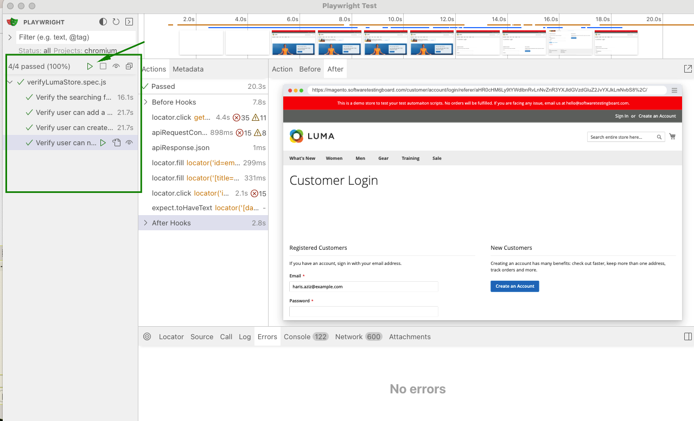
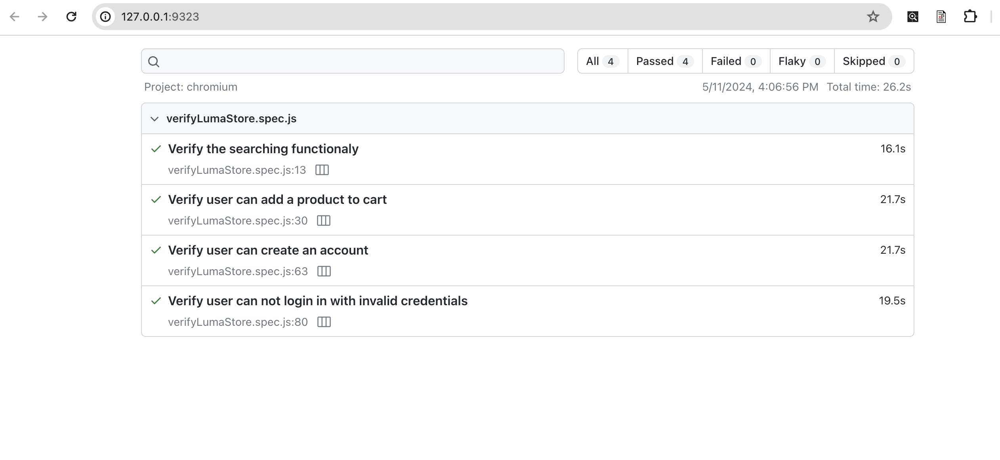

# lumastore-playwright 
👋 Hello!

# Project description
This is a simple personal project used to demonstrate the author's skills in Playwright testing automation.

Here we will apply the concepts of black box testing, where we will test the page https://magento.softwaretestingboard.com. 

This project will cover the following aspects of the website:
- Search for a valid term in the top menu and check whether the results page loaded correctly;
- Add a product to the cart;
- Create user;
- Verify user is not able to login with invalid credentials.

# Language, framework and technologies used
Playwright framework was used in this project, and the test cases were created using the JavaScript language, in conjunction with the Page Objects project pattern.

To generate user data, we used the API obtained from https://randomuser.me/.


# How to install and check the project?

A. After git clone this project to your local machine, access the project directory and do the following steps: 

1. **Install Playwright**: 
```bash
npm init playwright@latest
```

2. **Abra o o painel interativo do Playwright**: 
```bash
npx playwright test --ui
```

3. **In the Playwright UI mode**: Run the test case by clicking on the Play (>) icon




# Test reports

You can open the  HTML report with following command: 
```bash
npx playwright show-report
```
## ...et voila!

